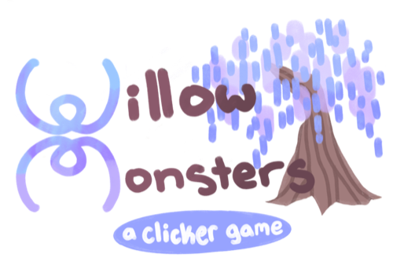
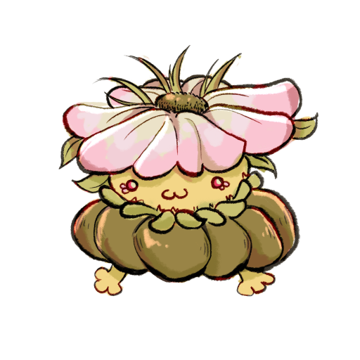
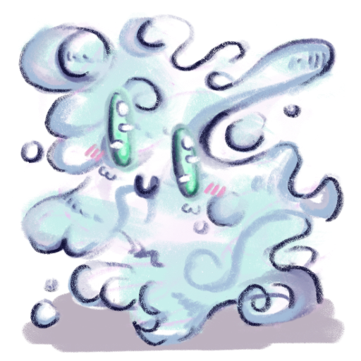
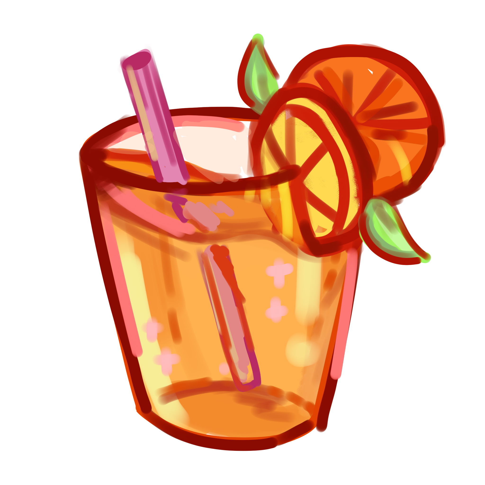
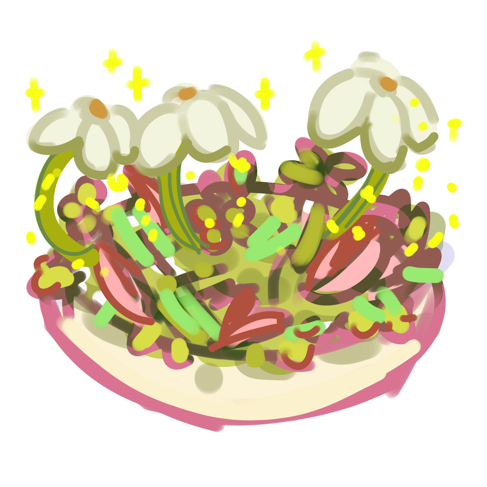
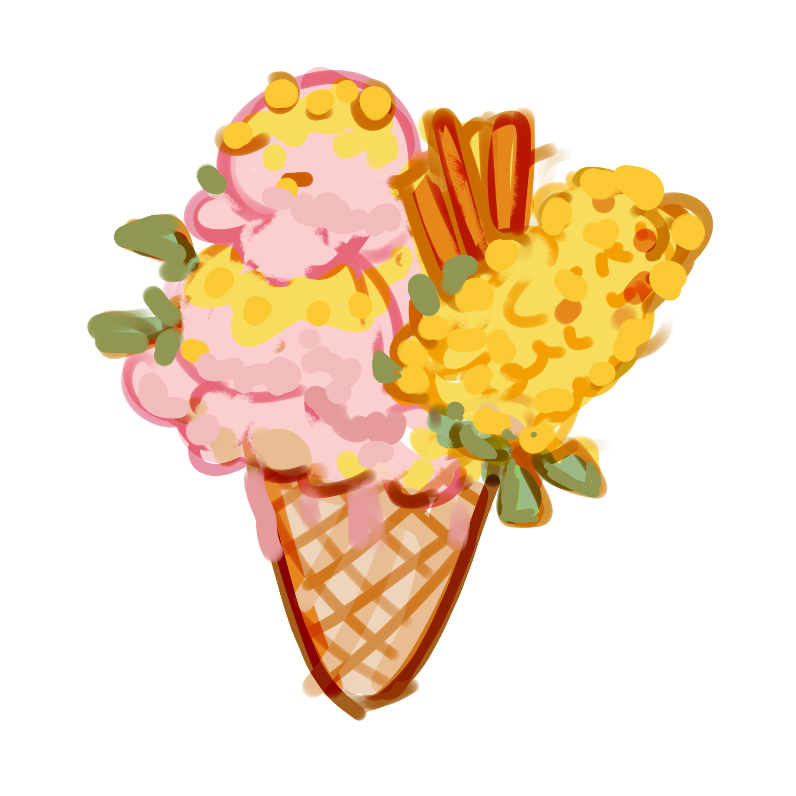
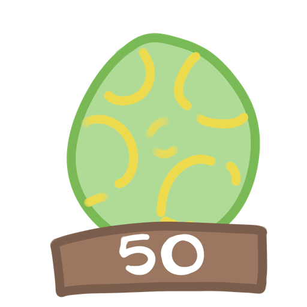
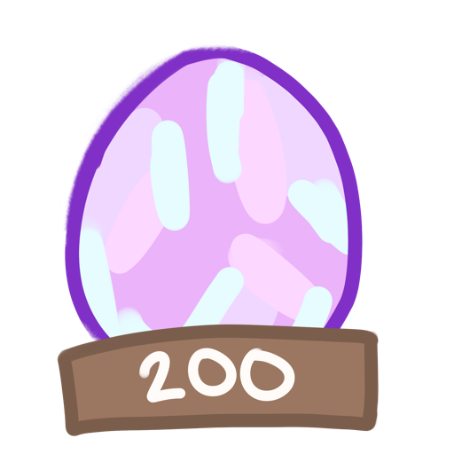
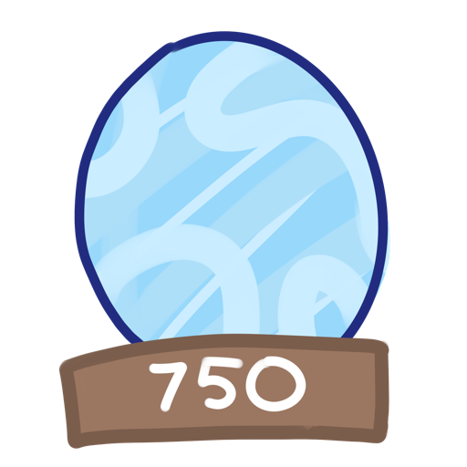

# Monster Clicker Game

A fun Android mobile game where you collect clicks to hatch adorable monster eggs and grow your willow tree!

## What is this game?

This is a clicker game (also called an idle game) where you tap a button to earn clicks (which work like money in the game). Use your clicks to hatch monster eggs, buy food to level up your monsters, and grow a magical willow tree. Can you reach 100,000 clicks and complete the game?

## How to Play

1. **Start Clicking**: Tap the willow tree to earn your first clicks
2. **Hatch Eggs**: When you have enough clicks, tap on an egg to hatch it
3. **Buy Food**: Purchase food items to feed and level up your monsters
4. **Level Up Monsters**: Feed your hatched monsters to increase their powers (up to Level 5!)
5. **Watch Your Tree Grow**: As you hatch more monsters, your willow tree grows bigger
6. **Reach the Goal**: Collect 100,000 clicks to win the game!

## The Monsters

Your goal is to hatch all three types of monsters and level them up to max level!

### Monster 1 - The Flower Monster

**Cost to Hatch**: 50 clicks
**Special Power**: Click Multiplier - increases the number of clicks you earn per tap
- Level 1: 2x clicks per tap
- Level 2: 3x clicks per tap
- Level 3: 5x clicks per tap
- Level 4: 10x clicks per tap
- Level 5 (MAX): 25x clicks per tap

### Monster 2 - The Jewel Pup

**Cost to Hatch**: 200 clicks
**Special Power**: Auto-clicker - earns clicks for you automatically every second
- Level 1: 1 click per second
- Level 2: 3 clicks per second
- Level 3: 5 clicks per second
- Level 4: 10 clicks per second
- Level 5 (MAX): 25 clicks per second

### Monster 3 - The Wisp

**Cost to Hatch**: 750 clicks
**Special Power**: Passive Boost - increases the power of your other monsters
- Level 1: +25% boost to all effects
- Level 2: +50% boost to all effects
- Level 3: +75% boost to all effects
- Level 4: +100% boost to all effects
- Level 5 (MAX): +150% boost to all effects

## The Food Shop

Feed your monsters to level them up! There are three types of food available:

### Orange & Lemon Tea

**Cost**: 25 clicks
**Food Points**: 10 points toward next level

### Clovers & Petals Salad

**Cost**: 50 clicks
**Food Points**: 25 points toward next level

### Strawberries & Corn Icecream

**Cost**: 100 clicks
**Food Points**: 50 points toward next level

**How to Feed Monsters**:
1. Click on a hatched monster
2. Select a food from the dropdown menu
3. Click the feed button to give the food to your monster
4. Watch your monster's level progress bar fill up!

## Game Features

### The Eggs

Before you hatch them, monsters appear as colorful eggs:

-  Egg 1
-  Egg 2
-  Egg 3

### The Growing Willow Tree

The willow tree at the center of your game grows as you hatch more monsters! It has 4 growth stages:
- Stage 1: Small sapling (starting tree)
- Stage 2: Young tree (after hatching first monster)
- Stage 3: Mature tree (after hatching second monster)
- Stage 4: Giant magical tree (after hatching all three monsters)

### Game Screens

**Landing Page**: Start your adventure or view the credits

**Main Game Screen**:
- A **willow tree** at the center - tap it to earn clicks
- A **click counter** showing your current clicks (displayed with a $ symbol)
- **Monster eggs/monsters** - tap eggs to hatch them, tap hatched monsters to feed and level them up
- **Food shop** at the bottom - tap food items to purchase them

**Monster Pop-up**: Click a hatched monster to see:
- Monster image and description
- Current level and progress bar
- Dropdown menu to select food
- Feed button to level up your monster

**Ending Page**: Win screen when you reach 100,000 clicks!

## Project Info

**Built with**: Android Studio
**Language**: Java
**Minimum Android Version**: Android 12 (API 31)

## How the Code Works

This game uses some cool programming concepts:

- **Classes**: The `Monster` and `Food` classes are blueprints that define game objects with their properties and behaviors
- **HashMaps**: The game uses HashMaps to efficiently store and retrieve Monster and Food objects by their keys
- **Lists and Arrays**: ArrayLists manage collections of UI elements, while Arrays store the food names
- **Event Listeners**: The game "listens" for when you tap buttons, eggs, monsters, and food items, then runs code to respond
- **Handlers and Runnables**: The auto-clicker uses Android's Handler to schedule repeated tasks every second
- **Dialogs**: Custom pop-up dialogs display monster information and feeding interface
- **Spinners**: Dropdown menus let players select which food to feed their monsters
- **Intents**: Navigate between different activities (landing page, main game, credits, ending)
- **Dynamic UI Updates**: The willow tree image and monster effects update based on game state
- **Level Progression System**: Monsters track their level, level cap, and current progress points

## Files to Check Out

### Java Classes
- `MainActivity.java` - The main game logic (click handling, monster hatching, food system, leveling, auto-clicker)
- `Monster.java` - Defines monster properties (cost, images, effects, level, level cap)
- `Food.java` - Defines food properties (cost, food points, amounts)
- `landingPage.java` - The starting screen with start and credits buttons
- `CreditPage.java` - Credits screen
- `endingPage.java` - Victory screen when reaching 100,000 clicks

### Layout Files
- `activity_main.xml` - The main game screen layout
- `landing_page.xml` - Landing page layout
- `monster_pop_up.xml` - Monster dialog layout with feeding interface
- `credit_page.xml` - Credits page layout
- `ending_page.xml` - Victory page layout

### Resources
- `res/drawable/` - All the game art (monsters, eggs, food, backgrounds, willow tree growth stages)
- `res/font/` - Custom fonts (Abril Fatface)

## Game Progression

To complete the game:
1. Hatch all three monsters (costs: 50, 200, 750 clicks)
2. Level up all monsters to Level 5 (requires purchasing and feeding food)
3. Reach 500,000 total clicks to reach the end of the game

**Strategy tip**: The Wisp's boost effect multiplies the power of your other monsters, so leveling up all three monsters together creates exponential growth!

Made with Android Studio
