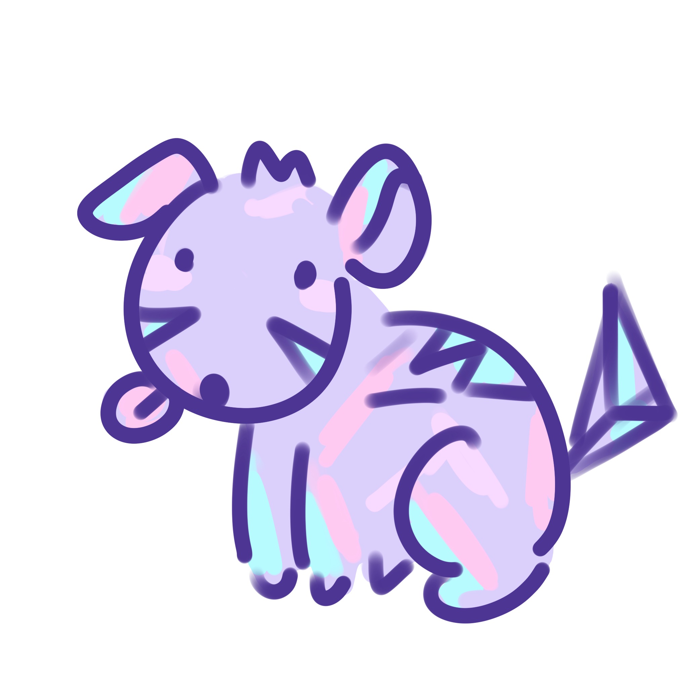

# Monster Clicker Game

A fun Android mobile game where you collect clicks to hatch adorable monster eggs!

## What is this game?

This is a clicker game (also called an idle game) where you tap a button to earn clicks (which work like money in the game). Use your clicks to buy and hatch monster eggs. Each monster you hatch gives you special powers to earn clicks faster!

## How to Play

1. **Start Clicking**: Tap the tree button to earn your first clicks
2. **Buy Eggs**: When you have enough clicks, tap on an egg to hatch it
3. **Collect Monsters**: Each monster gives you a special bonus!
4. **Watch Your Clicks Grow**: As you unlock more monsters, you'll earn clicks faster and faster

## The Monsters

Your goal is to hatch all three types of monsters:

### Monster 1 - The Flower Monster

**Cost**: 50 clicks
**Special Power**: Doubles your clicking power! Now each click earns you 2 clicks instead of 1

### Monster 2

**Cost**: 200 clicks
**Special Power**: Auto-clicker! This monster earns clicks for you automatically every second, even when you're not tapping

### Monster 3

**Cost**: 750 clicks
**Special Power**: Super Boost! Makes both your manual clicks AND auto-clicks 25% stronger

## What You'll See

### The Eggs

Before you hatch them, monsters appear as colorful eggs:

-  Egg 1
-  Egg 2
-  Egg 3

### The Game Screen

The game has:
- A **tree/clicker button** at the top - this is what you tap to earn clicks
- A **click counter** showing how many clicks you have (displayed with a $ symbol)
- **Monster eggs** in the middle - tap these to hatch them when you have enough clicks
- A **food shop** at the bottom (coming soon!)

## Project Info

**Built with**: Android Studio
**Language**: Java
**Minimum Android Version**: Android 12 (API 31)

## How the Code Works

This game uses some cool programming concepts:

- **Classes**: The `Monster` class is like a blueprint that defines what each monster is (what it costs, what picture it uses, what power it has)
- **Lists and Maps**: The game keeps track of all your monsters using special containers that organize information
- **Event Listeners**: The game "listens" for when you tap buttons and eggs, then runs code to make things happen
- **Timers**: The auto-clicker uses a timer to add clicks every second

## Files to Check Out

- `MainActivity.java` - The main game logic (where all the magic happens!)
- `Monster.java` - Defines what a monster is
- `activity_main.xml` - The layout of the game screen
- `res/drawable/` - All the cute monster and egg pictures!

## Future Ideas

Some things that could be added:
- The food shop buttons (currently just for decoration)
- More monsters with new powers
- Sound effects when eggs hatch
- Saving your progress so you don't lose it when you close the app

---

Made with Android Studio
